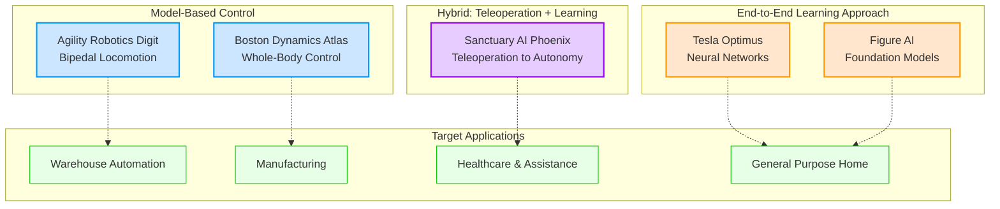

# Humanoid Robotics Landscape

## Industry Overview

The humanoid robotics industry has experienced explosive growth in 2024-2025, with multiple companies achieving remarkable demonstrations of bipedal locomotion, dexterous manipulation, and autonomous task execution. Unlike previous decades where humanoid robots were primarily research platforms, today's systems target commercial deployment in warehouses, factories, healthcare, and even homes.

This page surveys five leading humanoid platforms, examining their technical approaches, capabilities, and target applications. You will see three distinct strategies emerge:

1. **Model-Based Control**: Using classical robotics techniques (kinematics, dynamics, optimization) for precise, predictable behavior
2. **End-to-End Learning**: Training neural networks to map sensor inputs directly to motor commands
3. **Hybrid Approaches**: Combining teleoperation, imitation learning, and autonomous control

Understanding these approaches reveals fundamental trade-offs in humanoid robot design: generalization vs. precision, data requirements vs. engineering complexity, and adaptability vs. reliability.

## Boston Dynamics Atlas: Model-Based Whole-Body Control

### Overview

Boston Dynamics has been developing humanoid robots for over a decade. Their Atlas platform represents the state-of-the-art in model-based control, using sophisticated algorithms for balance, motion planning, and perception.

**Key Milestones:**
- 2013: DARPA Robotics Challenge (hydraulic Atlas)
- 2021: Parkour demonstrations with two Atlas robots
- April 2024: Retirement of hydraulic Atlas
- April 2024: Introduction of electric Atlas with expanded range of motion

### Technical Approach: Perception-Driven Model-Based Control

Unlike pre-programmed routines, Atlas uses **perception-driven behaviors**:
- **Computer vision** detects obstacles, terrain, and objects in real-time
- **Optimization-based motion planning** computes feasible whole-body trajectories
- **Feedback control** adjusts joint torques to track planned motions despite disturbances

**Whole-Body Control**: Atlas can balance using all four limbs, enabling complex maneuvers like:
- Parkour (jumping, vaulting, balance beams)
- Dynamic manipulation (throwing, catching)
- Terrain adaptation (rough ground, slopes, stairs)

### Demonstration

Watch Atlas perform parkour maneuvers requiring real-time perception and dynamic balance:

  <iframe
    style={{position: 'absolute', top: 0, left: 0, width: '100%', height: '100%'}}
    width="560"
    height="315"
    src="https://www.youtube.com/embed/_sBBaNYex3E"
    title="Boston Dynamics Atlas Parkour"
    frameBorder="0"
    allow="accelerometer; autoplay; clipboard-write; encrypted-media; gyroscope; picture-in-picture"
    allowFullScreen>
  </iframe>

[Can't see the video? Watch Boston Dynamics Atlas Parkour on YouTube](https://www.youtube.com/watch?v=_sBBaNYex3E)

**What to observe:**
- Precision landing on narrow beams (requires cm-level foot placement accuracy)
- Recovery from impacts (reactive control adjusts to unexpected forces)
- Complex sequences (backflips, vaults) executed fluidly

### Target Applications

Boston Dynamics emphasizes **manufacturing and logistics**:
- Material handling in warehouses
- Inspection in hazardous environments (nuclear, oil & gas)
- Research platform for advanced locomotion algorithms

**Limitations**: High cost, complex maintenance, and specialized deployment limit widespread adoption outside industrial settings.

---

## Tesla Optimus: End-to-End Neural Network Learning

### Overview

Tesla entered humanoid robotics in 2021 with the goal of creating a general-purpose robot for manufacturing and home use. Optimus leverages Tesla's expertise in neural networks and real-world data collection from millions of vehicles.

**Key Milestones:**
- October 2024: "We, Robot" event demonstrations
- May 2025: Autonomous factory deployment at Fremont
- December 2025: Jogging demonstration ("Just set a new PR in the lab")

### Technical Approach: End-to-End Learning

Optimus uses a **single neural network** for all tasks:
- **Vision-based perception**: Cameras provide RGB input (no LIDAR)
- **Neural network** maps images directly to joint commands
- **Trained on massive datasets**: Teleoperation, simulation, and real-world deployment data

**Key Insight**: Instead of hand-engineering controllers for each task, Tesla trains a general policy that learns from examples. This mirrors their approach to Full Self-Driving (FSD) in vehicles.

### Capabilities (2025)

- Smooth jogging with improved balance and gait control
- Autonomous navigation in factories with obstacle avoidance
- Stair climbing and uneven terrain locomotion
- Household tasks: trash disposal, sweeping, vacuuming, paper towel handling, pot stirring, cabinet operation
- Onboard vision processing (no external compute required)

### Demonstration

Watch Tesla Optimus perform household tasks and demonstrate improved locomotion:

  <iframe
    style={{position: 'absolute', top: 0, left: 0, width: '100%', height: '100%'}}
    width="560"
    height="315"
    src="https://www.youtube.com/embed/cpraXaw7dyc"
    title="Tesla Optimus Robot Latest Demonstration"
    frameBorder="0"
    allow="accelerometer; autoplay; clipboard-write; encrypted-media; gyroscope; picture-in-picture"
    allowFullScreen>
  </iframe>

[Can't see the video? Watch Tesla Optimus latest demos on YouTube](https://www.youtube.com/watch?v=cpraXaw7dyc)

**What to observe:**
- Natural-looking gait (smoother than earlier prototypes)
- Task versatility (wide range of manipulation skills)
- Real-world deployment (working in Fremont factory)

### Target Applications

- **Manufacturing**: Factory automation (Tesla's internal use case)
- **General Purpose Home Robots**: Long-term vision for household assistance
- **Target Production**: 5,000 units in 2025, scaling to tens of thousands by 2026

**Trade-offs**: End-to-end learning requires massive datasets and may lack the precision of model-based control for safety-critical tasks. However, it generalizes better to novel situations.

---

## Figure AI: Foundation Models for Humanoid Manipulation

### Overview

Figure AI, founded in 2022, focuses on humanoid robots for commercial deployment. Their landmark achievement was integrating OpenAI's multimodal foundation models to enable natural language task specification and reasoning.

**Key Milestone:**
- March 13, 2024: Demonstration of Figure 01 with OpenAI integration

### Technical Approach: Foundation Models + Manipulation

Figure's approach combines:
- **OpenAI-trained vision-language model**: Processes camera images and speech
- **Verbal reasoning**: Robot explains what it sees and why it takes actions
- **Real-time conversation**: No teleoperation during demosrobot responds autonomously

**Example Interaction:**
- Human: "I'm hungry"
- Robot: [Identifies apple on table] "I see an apple. I will give it to you." [Hands apple to human]

This demonstrates **contextual understanding** beyond pre-programmed responses.

### Demonstration

Watch Figure 01 with OpenAI integration demonstrate language-grounded manipulation:

  <iframe
    style={{position: 'absolute', top: 0, left: 0, width: '100%', height: '100%'}}
    width="560"
    height="315"
    src="https://www.youtube.com/embed/Sq1QZB5baNw"
    title="Figure 01 with OpenAI Integration"
    frameBorder="0"
    allow="accelerometer; autoplay; clipboard-write; encrypted-media; gyroscope; picture-in-picture"
    allowFullScreen>
  </iframe>

[Can't see the video? Watch Figure 01 OpenAI Integration Demo](https://www.youtube.com/watch?v=Sq1QZB5baNw)

**What to observe:**
- Natural language understanding (interprets abstract requests like "I'm hungry")
- Visual grounding (identifies objects and their affordances)
- Manipulation dexterity (grasping, handing objects)

### Current Status

Figure ended its collaboration with OpenAI in 2025 as large language models became "commoditized." However, the March 2024 demo remains a landmark achievement in grounding foundation models in physical interaction.

### Target Applications

- **Warehouse logistics**: Order fulfillment and sorting
- **Manufacturing**: Assembly and quality inspection
- **Retail**: Restocking shelves

**Significance**: Demonstrates that pre-trained AI models (GPT-4) can be adapted for embodied tasks, potentially accelerating robot learning by leveraging internet-scale knowledge.

---

## Sanctuary AI Phoenix: Teleoperation to Autonomy

### Overview

Sanctuary AI focuses on creating humanoid robots that learn tasks through **teleoperation**, where human operators control the robot to demonstrate skills. Recorded data is then used to train autonomous policies.

**Specifications (8th Generation Phoenix, December 2024):**
- Height: 170 cm
- Weight: 70 kg
- Maximum payload: 25 kg
- Full body mobility with human-like dexterous hands

### Technical Approach: Hybrid Teleoperation-Learning Pipeline

1. **Teleoperation Phase**: Human operator controls robot to demonstrate tasks (product sorting, assembly, manipulation)
2. **Data Collection**: Record sensor inputs (vision, force) and motor commands
3. **Policy Training**: Train neural network to replicate demonstrated behaviors
4. **Autonomous Execution**: Deployed robot performs tasks independently

**Key Capability**: Learn new tasks in less than 24 hours

### Demonstration

Watch Sanctuary AI Phoenix demonstrate dexterous manipulation and product sorting:

  <iframe
    style={{position: 'absolute', top: 0, left: 0, width: '100%', height: '100%'}}
    width="560"
    height="315"
    src="https://www.youtube.com/embed/ccEXaHHs8aY"
    title="Sanctuary AI Phoenix Humanoid Robot"
    frameBorder="0"
    allow="accelerometer; autoplay; clipboard-write; encrypted-media; gyroscope; picture-in-picture"
    allowFullScreen>
  </iframe>

[Can't see the video? Watch Sanctuary AI Phoenix Demo](https://www.youtube.com/watch?v=ccEXaHHs8aY)

**What to observe:**
- Dexterous hand manipulation (requires precise finger control)
- Task complexity (sorting diverse objects by size, color, type)
- Waist-up focus (less emphasis on locomotion, more on manipulation)

### Target Applications

- **Healthcare and eldercare**: Assistance with daily living tasks
- **Manufacturing**: Complex assembly requiring dexterity
- **Retail and logistics**: Product handling and organization

**Advantage**: Teleoperation allows rapid skill acquisition without requiring massive autonomous datasets. Humans provide the intelligence; robots provide the embodiment.

---

## Agility Robotics Digit: Bipedal Locomotion Specialist

### Overview

Agility Robotics, spun out of Oregon State University research, focuses on **bipedal locomotion for logistics**. Digit is designed specifically for warehouse automation rather than general-purpose tasks.

**Commercial Deployment Milestone:**
- November 2025: 100,000+ totes moved for GXO Logistics in multi-year deployment near Atlanta, Georgia

### Technical Approach: Locomotion-Focused Design

Digit prioritizes:
- **Stable bipedal walking**: Safe navigation in human spaces
- **Tote manipulation**: Optimized for picking and placing boxes/bins
- **Human-centric design**: Can operate in aisles designed for human workers

Unlike general-purpose humanoids, Digit is a **specialist** optimized for warehouse logistics.

### Demonstration

Watch Digit perform warehouse automation tasks in real commercial deployment:

  <iframe
    style={{position: 'absolute', top: 0, left: 0, width: '100%', height: '100%'}}
    width="560"
    height="315"
    src="https://www.youtube.com/embed/29ECwExc-_M"
    title="Agility Robotics Digit Warehouse Automation"
    frameBorder="0"
    allow="accelerometer; autoplay; clipboard-write; encrypted-media; gyroscope; picture-in-picture"
    allowFullScreen>
  </iframe>

[Can't see the video? Watch Digit Warehouse Automation Demo](https://www.youtube.com/watch?v=29ECwExc-_M)

**What to observe:**
- Autonomous navigation alongside AMRs (Autonomous Mobile Robots)
- Reliable tote handling in real commercial deployment
- Human-robot collaboration in shared workspace

### Production and Scaling

- **RoboFab factory** in Oregon
- Current production: Hundreds of units per year
- Roadmap: 10,000+ units annually

### Target Applications

- **Warehouse logistics**: Primary focus (order fulfillment, restocking)
- **Manufacturing**: Material transport
- **Retail**: Backroom automation

**Significance**: Digit represents the first large-scale commercial deployment of a bipedal humanoid robot. By focusing on a narrow domain (logistics), Agility Robotics achieves reliability and cost-effectiveness.

---

## Comparing Approaches

**Figure 2**: Humanoid robotics landscape showing three technical approaches (end-to-end learning, model-based control, hybrid teleoperation) and their target applications (warehouse automation, manufacturing, healthcare, general-purpose home use)

### Trade-offs Summary

| Approach | Strengths | Weaknesses | Examples |
|----------|-----------|------------|----------|
| **Model-Based** | Precision, predictability, safety guarantees | Engineering complexity, limited generalization | Atlas, Digit |
| **End-to-End Learning** | Generalization, data-driven, handles variability | Requires massive datasets, less interpretable | Optimus |
| **Foundation Models** | Leverages pre-trained knowledge, language grounding | Compute-intensive, requires sim-to-real transfer | Figure AI |
| **Teleoperation-Learning** | Rapid skill acquisition, human intelligence | Requires operator time, scalability challenges | Phoenix |

No single approach dominates. Choice depends on:
- **Task requirements**: Precision (model-based) vs. adaptability (learning)
- **Data availability**: Large datasets (end-to-end) vs. human demonstrations (teleoperation)
- **Deployment context**: Controlled environments (model-based) vs. unstructured spaces (learning)

## Summary

The humanoid robotics landscape reveals diverse strategies for achieving general-purpose physical intelligence:

1. **Boston Dynamics Atlas** exemplifies model-based control with perception-driven whole-body planning
2. **Tesla Optimus** demonstrates end-to-end neural network learning for task versatility
3. **Figure AI** shows how foundation models enable language-grounded manipulation
4. **Sanctuary AI Phoenix** uses teleoperation for rapid skill demonstration and learning
5. **Agility Robotics Digit** achieves commercial success through locomotion specialization

Each platform reflects different beliefs about the path to robust, deployable humanoid robots. The next 2-5 years will reveal which approaches scale to real-world complexity.

**Next**: In [Sensor Systems](/docs/weeks/week-01-02-physical-ai/sensor-systems), we examine the perception systems that enable these robots to see, feel, and navigate their environments.

---

## References

- [Boston Dynamics](https://www.bostondynamics.com/) - Official Atlas robot information and demos
- [IEEE Spectrum - Atlas Parkour](https://spectrum.ieee.org/boston-dynamics-atlas-parkour) - Technical analysis of Atlas capabilities
- [Tesla Optimus](https://www.tesla.com/optimus) - Official Tesla humanoid robot page
- [TeslaRati - Optimus Progress](https://www.teslarati.com/tesla-optimus-most-impressive-demonstration-video/) - Optimus demonstration analysis
- [Figure AI](https://www.figure.ai/) - Official Figure humanoid robot information
- [New Atlas - Figure OpenAI Integration](https://newatlas.com/robotics/figure-01-openai-humanoid-robot-real-time-conversations/) - Technical details on OpenAI integration
- [Sanctuary AI](https://www.sanctuary.ai/) - Phoenix robot specifications
- [IEEE Spectrum - Sanctuary Phoenix](https://spectrum.ieee.org/sanctuary-humanoid-robot) - General-purpose robot analysis
- [Agility Robotics](https://www.agilityrobotics.com/) - Digit robot and commercial deployments
- [Interesting Engineering - Digit Milestone](https://interestingengineering.com/ai-robotics/digit-humanoid-robot-moves-100000-totes) - 100K totes deployment milestone
