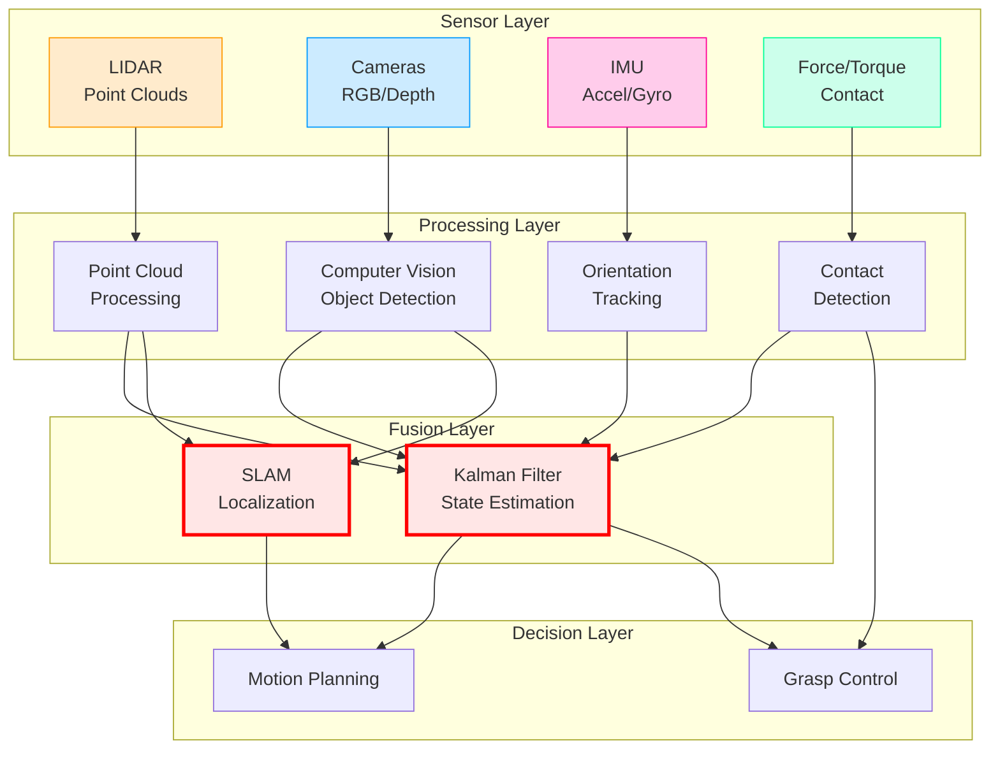

# Sensor Systems for Humanoid Robots

## Introduction

Humanoid robots must perceive their environment to navigate, manipulate objects, and interact with humans. Unlike digital AI systems that receive clean, structured inputs, physical robots rely on **sensors**devices that convert physical quantities (light, distance, force, acceleration) into electrical signals.

This page explores four primary sensor modalities used in humanoid robotics:

1. **LIDAR**: 3D point cloud generation for spatial mapping
2. **Cameras**: RGB, depth, and stereo vision for object recognition
3. **IMUs**: Accelerometers and gyroscopes for orientation tracking
4. **Force/Torque Sensors**: Contact detection and grip control

You will learn the operating principles, specifications, limitations, and typical use cases for each sensor type. Interactive code examples let you visualize sensor data and understand how multi-sensor fusion improves robustness.

## Sensor Data Flow in Robot Architecture

Before diving into individual sensors, consider how sensor data flows through a robot system:

**Figure 1**: Sensor data flows from raw measurements through processing layers to fusion algorithms (Kalman Filter, SLAM) that combine multiple sensor inputs for robust state estimation. Motion planning and grasp control consume fused state estimates.

**Key Insight**: No single sensor is sufficient. Robust perception requires **multi-sensor fusion** to overcome individual sensor limitations.

---

## LIDAR: 3D Point Cloud Generation

### Operating Principle

**LIDAR** (Light Detection and Ranging) measures distances by emitting laser pulses and timing their reflection:

1. Laser emits a short pulse of light
2. Light reflects off objects in the environment
3. Sensor detects the reflected light
4. **Time-of-flight** calculation: distance = (speed of light × time) / 2

By rotating the laser or using multiple laser channels, LIDAR generates a **3D point cloud**a set of (x, y, z) coordinates representing surfaces in the environment.

### Velodyne VLP-16 Specifications

The [Velodyne VLP-16](https://pdf.directindustry.com/pdf/velodynelidar/vlp-16-datasheets/182407-676097.html) is a popular LIDAR sensor used in robotics research and autonomous vehicles:

| Specification | Value |
|---------------|-------|
| **Channels** | 16 |
| **Range** | 100 m |
| **Precision** | ±3 cm |
| **Horizontal FOV** | 360° |
| **Vertical FOV** | 30° (±15°) |
| **Horizontal Resolution** | 0.2° at 10 Hz |
| **Vertical Resolution** | 2° |
| **Data Rate** | ~300,000 points/second |
| **Power** | 8 W |
| **Weight** | 830 g |

### When to Use LIDAR

**Strengths:**
- Accurate 3D spatial mapping (±3 cm precision)
- Works in darkness (active sensor, provides its own illumination)
- Long range (up to 100 m)
- Direct distance measurements (no stereo correspondence required)

**Limitations:**
- No color information (only geometric data)
- Expensive ($4,000-$8,000 for VLP-16)
- Reflective or transparent surfaces cause errors
- Lower resolution than cameras (thousands of points vs. millions of pixels)

**Typical Use Cases:**
- Navigation and obstacle avoidance
- 3D mapping (SLAM - Simultaneous Localization and Mapping)
- Terrain analysis for legged robots
- Object detection and tracking

### Interactive Example: LIDAR Point Cloud Visualization

This notebook simulates a LIDAR scan of a room with walls and obstacles, then visualizes the resulting 3D point cloud.

**What to observe:**
- Sparse 3D representation (thousands of points, not millions)
- Uniform sampling in angular space (not Cartesian space)
- How occlusions create "shadows" in the point cloud

---

## Camera Systems: RGB, Depth, and Stereo Vision

### Types of Cameras

1. **RGB Cameras**: Capture color images (standard cameras)
2. **Depth Cameras**: Measure distance to each pixel
3. **Stereo Cameras**: Use two RGB cameras to compute depth through triangulation

### Intel RealSense D455 Depth Camera

The [Intel RealSense D455](https://www.intelrealsense.com/depth-camera-d455/) uses **stereo vision** to compute depth:

| Specification | Value |
|---------------|-------|
| **Depth Technology** | Stereo vision |
| **Range** | 0.6 m to 6 m |
| **Depth Resolution** | 1280×720 at up to 90 FPS |
| **Depth FOV** | 86° × 57° |
| **RGB Sensor** | Yes (global shutter) |
| **IMU** | Yes |
| **Baseline** | 95 mm (distance between stereo cameras) |
| **Depth Error** | < 2% at 4 m |
| **Interface** | USB 3.1 |

### When to Use Each Camera Type

**RGB Cameras:**
- Object recognition (colors, textures, text)
- Semantic segmentation (classify pixels: person, chair, floor)
- Visual servoing (tracking targets for manipulation)
- Inexpensive and high resolution

**Depth Cameras:**
- Obstacle avoidance (know distances to objects)
- Grasp pose estimation (measure object dimensions)
- 3D reconstruction of scenes
- Works in varied lighting (active infrared illumination)

**Stereo Cameras:**
- Depth estimation without active illumination
- Outdoor use (where structured light may fail)
- Combines RGB and depth in single system

**Trade-offs:**
- **RGB alone**: No depth information
- **Depth alone**: Limited range (typically < 10 m), sensitive to lighting
- **Stereo**: Requires texture for correspondence (fails on blank walls)

### Interactive Example: Camera Image Processing

This notebook demonstrates basic image processing: loading an image, applying edge detection, and visualizing results.

**What to observe:**
- High resolution compared to LIDAR (megapixels vs. thousands of points)
- Edge detection reveals object boundaries
- Color information enables semantic understanding

---

## Inertial Measurement Units (IMUs)

### Operating Principle

An **IMU** (Inertial Measurement Unit) combines:
- **Accelerometer**: Measures linear acceleration (including gravity)
- **Gyroscope**: Measures angular velocity (rotation rate)
- Often includes **magnetometer** for absolute heading (not covered here)

By integrating accelerometer and gyroscope data, robots estimate **orientation** (roll, pitch, yaw) and **velocity**.

### Bosch BMI088 IMU Specifications

The [Bosch BMI088](https://www.bosch-sensortec.com/products/motion-sensors/imus/bmi088/) is a high-performance IMU used in robotics:

| Component | Range | Resolution | Noise |
|-----------|-------|------------|-------|
| **Accelerometer** | ±3g to ±24g | 16-bit | 175 µg/Hz |
| **Gyroscope** | ±125°/s to ±2000°/s | 16-bit | 0.014°/s/Hz |
| **Output Data Rate** | Up to 2 kHz |
| **Interface** | SPI, I2C |

### The Drift Problem

IMUs estimate orientation by **integrating** angular velocity:

¸(t) = ¸(0) + +É(t) dt

However, sensor noise causes **drift**: small errors accumulate over time. After a few minutes, estimated orientation may be off by 10-20 degrees without correction.

**Solution**: Fuse IMU data with other sensors (cameras, GPS, magnetometer) to correct drift.

### When to Use IMUs

**Strengths:**
- High update rate (1-2 kHz)
- Compact and inexpensive ($10-$100)
- Essential for balance control in legged robots

**Limitations:**
- Drift over time (requires sensor fusion)
- No absolute position (only orientation and acceleration)
- Sensitive to vibrations and electromagnetic interference

**Typical Use Cases:**
- Balance control (detect tilt and adjust motors to prevent falling)
- Sensor fusion for state estimation
- Dead reckoning (short-term position estimation)
- Detecting impacts or collisions

### Interactive Example: IMU Orientation Tracking

This notebook simulates an IMU measuring rotation, integrates angular velocity to estimate orientation, and demonstrates how noise causes drift over time.

**What to observe:**
- True orientation vs. estimated orientation diverge
- Drift accumulates linearly with time
- Need for sensor fusion to correct errors

---

## Force/Torque Sensors

### Operating Principle

**Force/torque sensors** measure mechanical forces and moments applied to a robot's end-effector (gripper, foot, wrist). They use **strain gauges**resistive elements that change resistance under deformation.

### ATI Mini45 Specifications

The [ATI Mini45](https://www.ati-ia.com/products/ft/ft_models.aspx?id=Mini45) is a compact 6-axis force/torque sensor:

| Specification | Value |
|---------------|-------|
| **Force Range** | ±290 N (z-axis), ±580 N (x/y-axis) |
| **Torque Range** | ±10 Nm |
| **Resolution** | 1/50 N (force), 1/500 Nm (torque) |
| **Dimensions** | Ø45 mm × 15 mm |
| **Weight** | 100 g |

### When to Use Force/Torque Sensors

**Strengths:**
- Detect contact (essential for safe manipulation)
- Measure grip force (avoid crushing or dropping objects)
- Enable compliant control (robot yields to external forces)
- Force feedback for delicate assembly tasks

**Limitations:**
- Expensive ($2,000-$5,000)
- Requires careful calibration
- Limited to measuring forces at sensor location (not distributed sensing)

**Typical Use Cases:**
- **Grasp control**: Adjust grip force based on object weight and fragility
- **Contact detection**: Know when hand touches an object
- **Compliant manipulation**: Allow robot to comply with external forces (polishing, wiping)
- **Safety**: Detect collisions and stop motion

---

## Multi-Sensor Fusion

No single sensor provides complete, reliable information. Robust robot perception requires **sensor fusion**combining data from multiple sensors to overcome individual limitations.

### Why Fusion is Necessary

| Sensor | Strengths | Weaknesses | Fusion Partner |
|--------|-----------|------------|----------------|
| **LIDAR** | Accurate 3D, long range | No color, expensive | Cameras (for semantics) |
| **RGB Camera** | High resolution, color | No depth | Depth camera or LIDAR |
| **Depth Camera** | Direct depth | Limited range, indoor | RGB camera or LIDAR |
| **IMU** | High rate, orientation | Drift | Cameras, GPS |
| **Force Sensor** | Contact detection | Local measurement | Vision (predict contact) |

### Fusion Techniques

1. **Weighted Averaging**: Combine sensor readings based on reliability
   - Example: Average LIDAR and depth camera distance estimates, weighting LIDAR higher

2. **Kalman Filtering**: Optimal fusion assuming Gaussian noise
   - Predict robot state using motion model
   - Update prediction using sensor measurements
   - Commonly used for IMU + camera fusion

3. **SLAM (Simultaneous Localization and Mapping)**: Fuse LIDAR/camera with odometry
   - Build map of environment while estimating robot position
   - Used in autonomous navigation

### Interactive Example: Multi-Sensor Fusion

This notebook simulates two noisy sensors measuring the same quantity and demonstrates how weighted averaging reduces uncertainty.

**What to observe:**
- Fused estimate has lower noise than either individual sensor
- Weights depend on sensor reliability (lower noise ’ higher weight)
- Fusion improves as more sensors are added

---

## Deep Dive: Kalman Filter Basics

:::tip Deep Dive: Kalman Filter for Sensor Fusion

The **Kalman Filter** is the gold standard for fusing sensor data under Gaussian noise assumptions. It operates in two steps:

### 1. Prediction Step (Motion Model)

Predict the next state based on dynamics:
- x(t|t-1) = F·x(t-1) + B·u(t)
- P(t|t-1) = F·P(t-1)·F^T + Q

Where:
- x: State estimate (position, velocity, orientation)
- F: State transition matrix (how state evolves)
- B: Control input matrix
- u: Control input (motor commands)
- P: Covariance matrix (uncertainty)
- Q: Process noise covariance

### 2. Update Step (Measurement)

Correct prediction using sensor measurement:
- K = P(t|t-1)·H^T·(H·P(t|t-1)·H^T + R)^-1  (Kalman Gain)
- x(t|t) = x(t|t-1) + K·(z - H·x(t|t-1))
- P(t|t) = (I - K·H)·P(t|t-1)

Where:
- z: Sensor measurement
- H: Measurement matrix (maps state to sensor reading)
- R: Measurement noise covariance
- K: Kalman gain (optimal weighting)

**Key Insight**: Kalman gain automatically balances prediction and measurement based on their relative uncertainties. If sensors are noisy (high R), trust the prediction more. If motion model is uncertain (high Q), trust measurements more.

**Further Reading:**
- Thrun, Burgard, Fox - "Probabilistic Robotics" (2005), Chapter 3
- [Kalman Filter Explained Visually](https://www.kalmanfilter.net/)

:::

---

## Summary

Humanoid robots rely on diverse sensor modalities:

1. **LIDAR**: Accurate 3D mapping, long range, works in darkness (VLP-16: ±3 cm precision, 100 m range)
2. **Cameras**: High-resolution color and depth (RealSense D455: 1280×720 depth, 0.6-6 m range)
3. **IMUs**: High-rate orientation tracking with drift (BMI088: 2 kHz, requires fusion)
4. **Force/Torque Sensors**: Contact detection and grip control (ATI Mini45: ±290 N, 1/50 N resolution)

**Multi-sensor fusion** is essential because no single sensor provides complete, reliable information. Techniques like Kalman filtering and SLAM combine sensor data to overcome individual limitations.

**Key Takeaway**: Sensor selection and fusion strategy are as important as algorithms. Physical AI systems must be designed holistically, considering sensor capabilities, noise characteristics, and fusion requirements.

**Next**: In [Assessment](/docs/weeks/week-01-02-physical-ai/assessment), test your understanding of Physical AI fundamentals through multiple choice questions, short answers, and a practical coding exercise.

---

## References

- [Velodyne VLP-16 Datasheet](https://pdf.directindustry.com/pdf/velodynelidar/vlp-16-datasheets/182407-676097.html) - Official LIDAR specifications
- [Intel RealSense D455](https://www.intelrealsense.com/depth-camera-d455/) - Depth camera specifications
- [Bosch BMI088 IMU](https://www.bosch-sensortec.com/products/motion-sensors/imus/bmi088/) - High-performance IMU datasheet
- [ATI Force/Torque Sensors](https://www.ati-ia.com/products/ft/ft_models.aspx?id=Mini45) - F/T sensor specifications
- [ROS 2 sensor_msgs](https://docs.ros.org/en/humble/p/sensor_msgs/) - Standard sensor message types
- Thrun, S., Burgard, W., & Fox, D. (2005). *Probabilistic Robotics*. MIT Press. - Kalman filtering and sensor fusion
