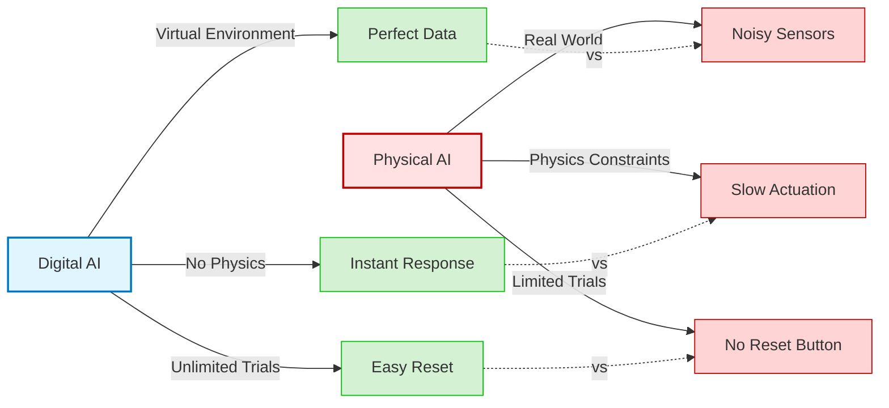

# What is Physical AI?

## Definition

**Physical AI** refers to artificial intelligence systems that interact with the physical world through sensors and actuators. Unlike digital AI that operates purely in software environments (text generation, image classification, game playing), Physical AI must perceive real-world conditions through imperfect sensors, reason about physical constraints, and execute actions through mechanical systems.

Key components of Physical AI include:
- **Perception**: Gathering information from the environment via sensors (cameras, LIDAR, IMUs, tactile sensors)
- **Reasoning**: Processing sensor data and planning actions while accounting for uncertainty and physical constraints
- **Action**: Executing motor commands through actuators (motors, hydraulics, pneumatics) to manipulate objects or navigate

Examples of Physical AI systems include humanoid robots, autonomous vehicles, drones, warehouse robots, and surgical robots. According to [NVIDIA's Physical AI documentation](https://docs.nvidia.com/learning/physical-ai/getting-started-with-isaac-sim/latest/index.html), Physical AI represents a fundamental shift from purely computational intelligence to embodied systems that must handle the complexity and uncertainty of real-world physics.

## Physical vs. Digital AI: Critical Differences

### Digital AI Advantages

Digital AI systems operate in controlled, virtual environments where:
- **Perfect Data**: Input data is clean and noise-free (text tokens, pixel values, game states)
- **Instant Response**: Computation happens as fast as hardware allows with no physical delays
- **Unlimited Trials**: Failures are cheapsimply reset the environment and try again
- **Deterministic Replay**: Same inputs produce same outputs (modulo random seeds)
- **No Safety Constraints**: Virtual agents cannot cause physical harm

### Physical AI Challenges

Physical AI must contend with:
- **Noisy Sensors**: All real-world sensors have measurement errors due to electromagnetic interference, temperature variations, and calibration drift
- **Actuation Latency**: Motors and hydraulics take time to respond, creating delays between decision and action
- **Limited Trials**: Hardware wear, safety risks, and costs make every trial expensive
- **Stochastic Environments**: Real-world physics is complex and unpredictable (friction varies, objects slip)
- **Safety Critical**: Physical mistakes can damage equipment, harm humans, or cause environmental damage

**Figure 1**: Comparison diagram showing three key differences between Digital AI (perfect data, instant response, unlimited trials) and Physical AI (noisy sensors, slow actuation, limited trials with no reset capability)

## The Sensor Noise Challenge

Real-world sensors are fundamentally imperfect. A LIDAR sensor measuring distance to a wall might report 2.97m, then 3.03m, then 2.99meven though neither the sensor nor the wall moved. This measurement noise arises from multiple sources:

- **Electromagnetic Interference**: Nearby electronics create noise in sensor circuits
- **Temperature Effects**: Sensor characteristics drift with temperature changes
- **Calibration Errors**: Manufacturing tolerances and aging affect accuracy
- **Environmental Factors**: Lighting conditions, humidity, and vibrations introduce variability

According to the [Velodyne VLP-16 LIDAR datasheet](https://pdf.directindustry.com/pdf/velodynelidar/vlp-16-datasheets/182407-676097.html), even high-quality sensors have ±3cm precision. For a humanoid robot trying to grasp a cup, this uncertainty can mean the difference between success and knocking the cup over.

### Interactive Example: Sensor Noise Simulation

The code example below demonstrates how Gaussian noise affects sensor measurements. Run this in Google Colab to see how measurement uncertainty impacts robot perception:

**What to observe:**
- The blue line (ideal sensor) shows perfect sinusoidal measurements
- The red line (real sensor) shows the same signal corrupted by noise
- RMSE (Root Mean Square Error) quantifies average deviation
- SNR (Signal-to-Noise Ratio) measures signal quality in decibels

**Key Takeaway**: Physical AI systems must be robust to noisy, uncertain measurements. Techniques like Kalman filtering, sensor fusion, and probabilistic state estimation help robots reason despite imperfect data.

## Real-Time Constraints

Unlike digital AI systems that can take seconds or minutes to generate outputs, physical robots operate in continuous time. The world does not pause while a robot computes its next action.

Control loops in robotics must run at fixed rates:
- **Balancing Control**: 100-1000 Hz (humanoids must react to falling within milliseconds)
- **Motion Planning**: 10-100 Hz (update trajectories as environment changes)
- **Vision Processing**: 30-60 Hz (match camera frame rates)

As documented in [ROS 2 real-time programming guidelines](https://docs.ros.org/en/humble/Tutorials/Demos/Real-Time-Programming.html), real-time systems must avoid:
- Dynamic memory allocation (causes unpredictable delays)
- Indefinitely blocking operations (deadlocks halt the control loop)
- Page faults and cache misses (introduce jitter)

**Example**: A humanoid robot walking on uneven terrain must adjust foot placement within 5-10ms of detecting a disturbance. If the control loop takes 100ms to respond, the robot will fall.

**Contrast with Digital AI**: GPT-4 can take 30 seconds to generate a response. A game-playing agent can pause and think. Physical robots have no such luxury.

## The Sim-to-Real Gap

Training robots in simulation is attractive: it is safe, fast, and inexpensive. Simulators like [NVIDIA Isaac Sim](https://docs.nvidia.com/learning/physical-ai/getting-started-with-isaac-sim/latest/index.html) allow robots to practice millions of grasps, falls, and navigations without breaking hardware.

But simulations are imperfect approximations of reality:
- **Physics Simplifications**: Friction, contact, and deformation are hard to model accurately
- **Simplified Sensors**: Simulated cameras and LIDAR lack noise, lens distortion, and motion blur
- **Missing Variability**: Real-world lighting, textures, object weights, and surface properties vary unpredictably

### Why the Sim-to-Real Gap Matters

A robot trained to grasp objects in simulation might fail in the real world because:
- Simulated friction was too high (real objects slip)
- Sensor noise was underestimated (real cameras have motion blur)
- Object weights were uniform (real objects have unexpected mass distributions)

### Bridging the Gap

According to NVIDIA's [sim-to-real transfer documentation](https://docs.nvidia.com/learning/physical-ai/getting-started-with-isaac-lab/latest/an-introduction-to-robot-learning-and-isaac-lab/04-tying-it-all-together/01-tying-it-together.html), techniques to close the gap include:

1. **Domain Randomization**: Vary simulation parameters (lighting, friction, object sizes) during training to force the policy to be robust
2. **Noise Injection**: Add realistic sensor noise to simulated data to match real-world conditions
3. **State Estimation Matching**: Ensure the robot's internal state estimates match between sim and real
4. **Residual Learning**: Train a base policy in simulation, then fine-tune on real hardware

**Critical Success Factor**: Real-world state estimation must match simulation. If the robot thinks it is 10cm from a wall but is actually 15cm away, collision avoidance fails.

## Safety and Irreversibility

Physical AI mistakes have real consequences:
- **Hardware Damage**: A humanoid falling damages motors, sensors, and structural components (thousands of dollars per failure)
- **Human Injury**: Robots operating near people must guarantee safety (ISO 13482 safety standards)
- **Environmental Damage**: Industrial robots can destroy workpieces, tools, or facilities

**No Reset Button**: Unlike video games or simulations, the physical world cannot be instantly reset. A broken component requires repair or replacement. An injured human cannot be "reloaded from checkpoint."

This necessitates:
- **Safe Exploration Algorithms**: Learning policies must avoid dangerous states
- **Emergency Stop Systems**: Hardware kill switches and software safety monitors
- **Conservative Policies**: Prefer slower, safer actions over aggressive, risky ones

## Summary

Physical AI is fundamentally different from digital AI because:

1. **Sensors are noisy**: Measurement uncertainty requires probabilistic reasoning
2. **Actions have latency**: Real-time constraints demand fast, fixed-rate control loops
3. **The world is complex**: Sim-to-real transfer requires domain randomization and careful state estimation
4. **Mistakes have consequences**: Safety is paramountthere is no undo button

**Why This Matters**: Humanoid robots must navigate unstructured human environments, manipulate diverse objects, and operate safely around people. Success requires algorithms that handle uncertainty, meet real-time deadlines, and prioritize safety.

**Next**: In [Embodied Intelligence](/docs/weeks/week-01-02-physical-ai/embodied-intelligence), we explore why physical form matters and how the humanoid body shape enables operation in human-designed spaces.

---

## References

- [NVIDIA Isaac Sim - Getting Started](https://docs.nvidia.com/learning/physical-ai/getting-started-with-isaac-sim/latest/index.html) - Official documentation on Physical AI and simulation
- [NVIDIA Isaac Lab - Sim-to-Real Transfer](https://docs.nvidia.com/learning/physical-ai/getting-started-with-isaac-lab/latest/an-introduction-to-robot-learning-and-isaac-lab/04-tying-it-all-together/01-tying-it-together.html) - Techniques for bridging the sim-to-real gap
- [ROS 2 Real-Time Programming](https://docs.ros.org/en/humble/Tutorials/Demos/Real-Time-Programming.html) - Real-time constraints in robotics
- [Velodyne VLP-16 Datasheet](https://pdf.directindustry.com/pdf/velodynelidar/vlp-16-datasheets/182407-676097.html) - LIDAR sensor specifications showing ±3cm precision
